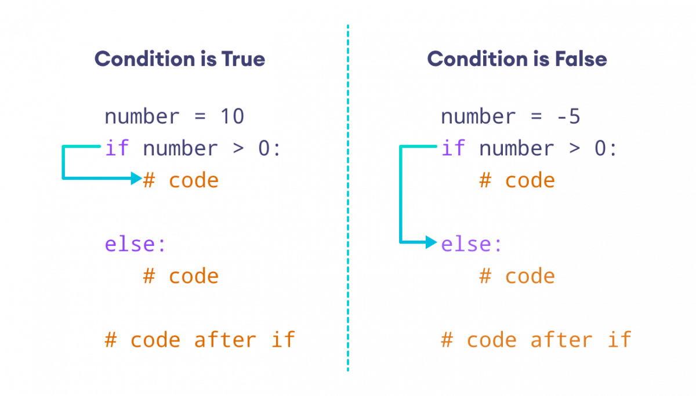

<!-- _class: title -->

# Introduction | مقدمه
<br/>

**مدرس: [معین آعلی](https://github.com/moeeinaali)**

**تابستان ۱۴۰۴**

---


# مزایا و معایب پایتون


---

# مزایای پایتون 

- **سادگی و خوانایی**: کد پایتون بسیار ساده و قابل فهم است
- **یادگیری آسان**: مناسب برای مبتدیان و برنامه‌نویسان تازه‌کار
- **کتابخانه‌های فراوان**: هزاران کتابخانه آماده برای استفاده
- **سازگاری**: اجرا روی تمام سیستم‌عامل‌ها
- **جامعه بزرگ**: پشتیبانی قوی از جامعه برنامه‌نویسان

---

# معایب پایتون 

- **سرعت**: کندتر از زبان‌های کامپایل شده مثل جاوا و سی و گولنگ
- **مصرف حافظه**: مصرف حافظه بیشتر نسبت به زبان‌های دیگر
- **خطاهای Runtime**: برخی خطاها فقط در زمان اجرا مشخص می‌شوند
- **محدودیت‌های Mobile**: توسعه اپلیکیشن‌های موبایل محدود
- **محدودیت در پردازش موازی**


---

# کاربردهای پایتون 


---

# کاربردهای پایتون 

- **توسعه وب**: Django, Flask, FastAPI
- **علم داده**: Pandas, NumPy, Matplotlib
- **هوش مصنوعی**: TensorFlow, PyTorch, Scikit-learn
- **اتوماسیون**: اسکریپت‌های خودکار
- **توسعه بازی**: Pygame, Arcade
- **توسعه دسکتاپ**: Tkinter, PyQt, Kivy

---


# ویژگی‌های پایتون 

- **زبان تفسیری**: کد خط به خط اجرا می‌شود
- **پویا**: نوع داده‌ها در زمان اجرا مشخص می‌شود
- **شیءگرا**: پشتیبانی کامل از برنامه‌نویسی شیءگرا
- **تابع‌گرا**: پشتیبانی از برنامه‌نویسی تابع‌گرا
- **مدیریت حافظه خودکار**: Garbage Collection خودکار

---

# محیط‌های توسعه 

- **IDLE**: محیط پیش‌فرض پایتون
- **PyCharm**: محیط حرفه‌ای JetBrains
- **VS Code**: ویرایشگر سبک با افزونه‌های قوی
- **Jupyter Notebook**: مناسب برای علم داده

---

# اولین برنامه

```python
print("Hello, World!")
```

---

<!-- _class: title -->

# Variables | متغیرها
<br/>

**مدرس: [معین آعلی](https://github.com/moeeinaali)**

**تابستان ۱۴۰۴**

---

# متغیر چیه؟


**ظرف‌هایی از جنس‌های مختلف برای نگه‌داری اطلاعات درون خودشان!**
<br/>

### چه جنس‌هایی؟

- اعداد
  - صحیح
  - اعشاری
  - مختلط
- رشته‌ها
- منطقی

---
# انواع متغیرها


---

# چطور متغیر تعریف کنیم؟


+ تو پایتون نیازی نیست از کلیدواژه‌ خاصی استفاده کنی!
+ می‌تونیم مثل ریاضی متغیرهاتو نامگذاری و تعریف کنی!

مثلا:

```Python
x = 5
y = 3.14
name = "moeein"
flag = True
```

---

# چطور متغیر تعریف کنیم؟


### نمیشه چندتایی تعریف کرد؟

```python
x, y, z = "Orange", "Banana", "Cherry"
print(x)
print(y)
print(z)
```

###### معلومه که میشه!

### نمیشه چندتارو همزمان یک مقدار داد؟

```python
x = y = z = "Orange"
print(x)
print(y)
print(z)
```

###### معلومه که میشه!

---

# نامگذاری متغیرها


### چیا مجازه؟

- حروف کوچک و بزرگ
- آندرلاین (ـ)
- اعداد

### چطور مجازه؟

```Python
a1 = 2
first_name = "moeein"
first_name1 = "mamad"
_name = "moeein"
_1 = 2
```

### چطور مجاز نیست؟
عدد اول اسم بیاد!

---

# نامگذاری متغیرها

#### حواستون به بزرگ و کوچیک بودن کارکترها باشه!

```Python
a = 2
A = 3
aA = 4
Aa = 5
```

```python
naMe = "moeein"
namE = "saeed"
NamE = "amir"
nAmE = "amirhossein"
```

---

# نامگذاری متغیرها

### چطور نامگذاری کنیم؟


---

# چاپ کردن

### چطور مقدار یک متغیر رو چاپ کنیم؟

```Python
name = "moeein"
print("moeein")

age = 22
print(age)

flag = True
print(flag)
```

---
<!-- _class: title -->

# Printing | چاپ کردن
<br/>

**مدرس: [معین آعلی](https://github.com/moeeinaali)**

**تابستان ۱۴۰۴**

---


# چاپ کردن

### چطور مقدار یک متغیر رو چاپ کنیم؟

```Python
name = "moeein"
print("moeein")

age = 22
print(age)

flag = True
print(flag)
```

---

# چاپ کردن

### فقط چاپ کردن متغیر مجازه؟

```Python
print("moeein")

print(-2)

print(True)
```

###### معلومه که نه!

---

# چاپ کردن

### حتما باید یدونه‌ای چاپ کنیم؟

```Python
print("moeein", "amirhossein", "saeed")

print(1, 2, 3)

print(True, False, True, False)
```

###### معلومه که نه!

---

# چاپ کردن

### نمیشه هم متغیر چاپ کرد هم مقدار؟

```Python
name = "moeein"
print(name, "amirhossein", "saeed")

age = 18
print(1, 2, 3, age)

flag = True
print(flag, False)
```

###### معلومه که میشه!

---

# کلیدهای خاص

- #### n\ : زدن یک enter (رفتن به خط بعد)
- #### t\ : زدن یک tab
- #### '\ : یک عدد کوتیشن
- #### "\ : یک عدد دبل‌کوتیشن
- #### \\\ : یک عدد بک‌اسلش

#### مثال:

```python
print("moeein\naali")

print("1\n2\n3")

print("1\n\n2")
```


---

# پایان خاص برای چاپ کردن

پایان معمولی:

```python
print("moeein" , end="\n")
```

یک پایان خاص:

```python
print("moeein" , end="***\n")
```

یک پایان خیلی خاص:

```python
print("moeein" , end="\t***\t")
print("saeed" , end="\t***\t")
```

---
<!-- _class: title -->

# Comments | کامنت‌ها
<br/>

**مدرس: [معین آعلی](https://github.com/moeeinaali)**

**تابستان ۱۴۰۴**

---


# کامنت چیه؟

**در پایتون، کامنت (Comment) متنی است که داخل کد نوشته می‌شود ولی توسط مفسر اجرا نمی‌شود.**

<br/>
<br/>

### هدف اصلی کامنت‌ها:

- توضیح کد برای خودت یا دیگران

- خواناتر کردن برنامه

- غیرفعال کردن موقت یک بخش از کد برای تست یا اشکال‌زدایی

---

# چطور کامنت بذاریم؟

## کامنت تک خطی:

```python
# This is a comment

print("Hello, World!")
```

##### حتی میشه کامنت رو جلو یک کد نوشت:

```python
print("Hello, World!") # This is a comment 
```
---

# چطور کامنت بذاریم؟

## کامنت چند خطی:

```python
# This is a comment
# written in
# more than one line

print("Hello, World!")
```

```python
"""
This is a comment
written in
more than one line
"""

print("Hello, World!")
```
---

<!-- _class: title -->

# Casting | تبدیل نوع داده


<br/>

**مدرس: [معین آعلی](https://github.com/moeeinaali)**

**تابستان ۱۴۰۴**

---
# یادآوری: انواع داده‌ها در پایتون

- اعداد صحیح (int)
- اعداد اعشاری (float)
- متغیر منطقی (bool)
- رشته (str)

```python
a = 2 # int

b = 2.2 # float

c = "2" # str

d = "moeein" # str

e = "#$%@#$^%GVEARFHGBEA4534Cfwefgw" # str
```

---

# تبدیل به int

#### تبدیل int به int:

```python
x = int(1)   # x will be 1
```

#### تبدیل float به int:
```python
y = int(2.9999) # y will be 2

y = int(2.0) # y will be 2
```

#### تبدیل str به int:
```python
z = int("3") # z will be 3

z = int("123m") # Error!
```

---

# تبدیل به float

#### تبدیل int به float:

```python
x = float(1)     # x will be 1.0
```

#### تبدیل float به float:
```python
y = float(2.8)   # y will be 2.8
```

#### تبدیل str به float:
```python
z = float("3")   # z will be 3.0

w = float("4.2") # w will be 4.2

p = float("4.2m") # Error!
```
---

# تبدیل به str


#### تبدیل float به str:

```python
a = str(1.2)
```

#### تبدیل int به str:

```python
b = str(1)
```

#### تبدیل str به str:

```python
b = str("1") 
```

---

# تبدیل به bool

#### تبدیل str به bool:

```python
print(bool("")) # False
print(bool("others")) # True
```

#### تبدیل int به bool:

```python
print(bool(0)) # False
print(bool(1)) # True
print(bool(-1)) # True
```

#### تبدیل float به bool:

```python
print(bool(0.0)) # False
print(bool(1.1)) # True
print(bool(-2.1)) # True
```

---

# تبدیل از bool

#### تبدیل bool به int:

```python
print(int(True)) # 1
print(int(False)) # 0
```

#### تبدیل bool به float:

```python
print(float(True)) # 1.0
print(float(False)) # 0.0
```

#### تبدیل bool به str:

```python
print(str(True)) # "True"
print(str(False)) # "False"
```

---

<!-- _class: title -->

# Input | ورودی گرفتن
<br/>

**مدرس: [معین آعلی](https://github.com/moeeinaali)**

**تابستان ۱۴۰۴**

---

# ورودی گرفتن تکی

### رشته:

```python
name = input() # "moeein aali"
print(name) # "moeein aali"
```

### عدد صحیح:

```python
age = int(input()) # "18"
print(age) # 18
```

### عدد اعشاری:

```python
height = float(input()) # "12.3"
print(height) # 12.3
```

**نکته مهم: همه ورودی‌های کاربر به صورت `Str` هستند!**

---

# چاپ راهنما

### استفاده از `print`:

```python
print("please enter your name:")

name = input()

print("Hello",name,end="!\n")
```

### استفاده از آرگومان `input`:

```python
name = input("please enter your name:")

print("Hello",name,end="!\n")
```

---

# Split

**کاربرد: جداسازی یک Str توسط یک Str دیگر بر حسب یک الگوی مشخص**

###### مثال ۱:

```python
full_name = "moeein aali"
first_name, last_name = full_name.split(" ")
```

###### مثال ۲:

```python
names = "moeein amirhossein saeed"
name1 , name2 , name3 = names.split(" ")
```

###### مثال ۳:

```python
names = "moeein amirhossein saeed"
name1 , name2 , name3 = names.split()
```

---

# Split

###### مثال ۴:

```python
names = "moeein|amirhossein|saeed"
name1 , name2 , name3 = names.split("|")
```

###### مثال ۵:

```python
names = "moeein|amirhossein|saeed"
seperator = "|"
name1 , name2 , name3 = names.split(seperator)
```

---

# Split: جدا کردن به تعداد محدود

#### نمونه:
```python
txt = "apple#banana#cherry#orange"

a , b = txt.split("#", 1) # apple , banana#cherry#orange

m , n , p = txt.split("#", 2) # apple , banana , cherry#orange
```

---

# ورودی گرفتن چندتایی


### رشته:

```python
name1 , name = input().split()
```

### عدد صحیح:

```python
num1 , num2 = int(input().split()) # Error!
```

---

# Map


---

# Map


```python
num1 , num2 = map(int , input().split())

num3 , num4 = map(float , input().split())
```

نکات مهم:

- اگه ورودی‌ها عدد نباشن کد خطا میده!
- اگه به جای چند تا متغیر، یدونه متغیر قرار بدیم،‌همه ورودی‌ها در قالب یک **لیست** ذخیره می‌شن. در فصل‌های بعد با لیست و کاربردهای اون آشنا می‌شیم...

---

<!-- _class: title -->

# Operators | عملگر‌ها

<br/>

**مدرس: [معین آعلی](https://github.com/moeeinaali)**

**تابستان ۱۴۰۴**

---

# عملگرهای محاسباتی


---

# عملگرهای انتسابی


---

# عملگرهای مقایسه‌ای


---

# عملگرهای منطقی


---

# عملگرهای منطقی


---

# عملگرهای هویت


---

# عملگرهای هویت

#### مثال:

```python
a = True 

print(a is True) # True
print(a is not False) # False
```

---

# عملگرهای عضویت


---

# عملگرهای عضویت


```python
good_numbers = [1,2,3,4]

print(1 in good_numbers) # True

print(5 not in good_numbers) # True

print(5 in good_numbers) # False

```

---

# عملگرهای بیتی (معرفی)


---
<!-- _class: title -->

# Conditions | شرط‌ها

<br/>

**مدرس: [معین آعلی](https://github.com/moeeinaali)**

**تابستان ۱۴۰۴**

---

# if 


---

# if + else


---

# if + elif + else


---

# if + else



---

# if + elif + else


---

# nested if


---

# nested if


---

# Match Statement

- به جای نوشتن تعداد زیادی `if` و `elif` می‌تونی از این سختار استفاده کنی!

```python
day = 4
match day:
  case 1:
    print("Monday")
  case 2:
    print("Tuesday")
  case 3:
    print("Wednesday")
  case 4:
    print("Thursday")
  case 5:
    print("Friday")
  case 6:
    print("Saturday")
  case 7:
    print("Sunday")
```
---

# Default Value in Match Statement

### مقدار پیش‌فرض

- با استفاده از `_` می‌توانید حالتی را در نظر بگیرید که هیچ کدام از `case` ها با مقدار متغیر `match` نمی‌شوند!

```python
day = 4
match day:
  case 6:
    print("Today is Saturday")
  case 7:
    print("Today is Sunday")
  case _:
    print("Looking forward to the Weekend")
```

---

# Combine Values in Match Statement

### ترکیب مقادیر

- از کاراکتر پایپ `|` به عنوان عملگر `or` در ارزیابی `case` برای بررسی تطابق بیش از یک مقدار در یک `case` استفاده کنید:

```python
day = 4
match day:
  case 1 | 2 | 3 | 4 | 5:
    print("Today is a weekday")
  case 6 | 7:
    print("I love weekends!")
```

---

<!-- _class: title -->

# Lists | لیست‌ها

<br/>

**مدرس: [معین آعلی](https://github.com/moeeinaali)**

**تابستان ۱۴۰۴**

---

# Lists

#### کاربرد:
- ذخیره‌ی تعدادی داده، داخل یک متغیر

```python
items = ["apple", "banana", "cherry"]
print(items)

items2 = ["moeein", 1, True, -1.1]
print(items2)
```

#### خصوصیات:

- ترتیب ثابت
- آیتم‌های قابل تغییر
- امکان وجود آیتم تکراری
- امکان وجود آیتم‌ها با تایپ‌های مختلف

---

# Lists


---

# List Length

- به دست آوردن تعداد عضوهای یک لیست
- به دست آوردن طول یک لیست

```python
thislist = ["apple", "banana", "apple"]

print(len(thislist)) # 3
```

--- 

# Access List Items

- دسترسی به عضو `n`ام از یک لیست

**نکته: شروع `index`ها از 0 است.**

```python
thislist = ["apple", "banana", "cherry"]

print(thislist[0]) # banana
print(thislist[1]) # apple
print(thislist[2]) # cherry
```
---

# Negative Indexing
#### ایندکس منفی

- شروع از انتها
  - ایندکس `1-` یعنی عضو آخر لیست
  - ایندکس `2-` یعنی عضو یکی مانده به آخر لیست
  - ...

```python
thislist = ["apple", "banana", "cherry"]

print(thislist[-1]) # cherry
```

---


# Range of Indexes

- `list[start:end]`

```python
thislist = ["apple", "banana", "cherry", "orange", "kiwi", "melon", "mango"]
print(thislist[2:5]) # ["cherry", "orange", "kiwi"]
```

- `list[start:end:index]`

```python
thislist = ["apple", "banana", "cherry", "orange", "kiwi", "melon", "mango"]
print(thislist[2:5]) # ["cherry", "orange", "kiwi"]
```

- `list[start:]`

```python
thislist = ["apple", "banana", "cherry", "orange", "kiwi", "melon", "mango"]
print(thislist[2:]) # ["cherry", "orange", "kiwi", "melon", "mango"]
```

---


# Change Item Value

- برای تغییر دادن یک آیتم‌ خاص از لیست، کافیه که مثل متغیرها به اون آیتم مقدار جدید `assign` کنیم.

```python
thislist = ["apple", "banana", "cherry"]

thislist[1] = "blackcurrant"

print(thislist)
```


---

# Change a Range of Item Values

- برای تغییر دادن یک رنج از لیست، نیازه که یک لیست جدید با طول برابر با رنج مورد نظر با مقادیر جدید ایجاد کنیم. سپس آن رنج را در لیست مد نظر `assign` کنیم.

<br/>

```python
thislist = ["apple", "banana", "cherry", "orange", "kiwi", "mango"]

thislist[1:3] = ["blackcurrant", "watermelon"]

print(thislist)
```

- **دقت کنید که طول رنج انتخاب شده با طول لیست جدید یکی باشد!**


---

# Append Items

- این متد، مقدار جدید را به انتهای لیست اضافه می‌کند.

```python
thislist = ["apple", "banana", "cherry"]

thislist.append("orange")

print(thislist) # ['apple', 'banana', 'cherry', 'orange']
```

---

# Insert Items

- این متد، مقدار جدید را دقیقا در ایندکس مورد نظر قرار می‌دهد و باقی اعضای لیست را شیفت می‌دهد.


```python
thislist = ["apple", "banana", "cherry"]

thislist.insert(2, "watermelon")

print(thislist) # ['apple', 'banana', 'watermelon', 'cherry']
```

---

# Extend List

- این متد یک لیست دیگر را به انتهای لیست فعلی اضافه می‌کند. عملکرد مشابه به `append` دارد با این تفاوت که ورودی آن به یک مقدار، لیستی از مقادیر است.


```python
list1 = ["apple", "banana", "cherry"]

list2 = ["mango", "pineapple", "papaya"]

list1.extend(list2)

print(list1) # ['apple', 'banana', 'cherry', 'mango', 'pineapple', 'papaya']
```

---

# Extend List

- روش دوم:

```python
list1 = ["apple", "banana", "cherry"]

list2 = ["mango", "pineapple", "papaya"]

list3 = list1 + list2

print(list3) # ['apple', 'banana', 'cherry', 'mango', 'pineapple', 'papaya']
```

---

# Remove Specified Item

- برای این کار از متد `remove` استفاده می‌کنیم.

```python
thislist = ["apple", "banana", "cherry"]

thislist.remove("banana")

print(thislist)
```

- اگر بیشتر از یک مقدار وجود داشته باشد که با ورودی `remove`‌ یکی باشد، این متد فقط اولین عضو را عضو می‌کند.

```python
thislist = ["apple", "banana", "cherry", "banana", "kiwi"]

thislist.remove("banana")

print(thislist)
```

---

# Remove Specified Index

- برای این کار از متد `pop` استفاده می‌کنیم.
- این متد مقدار عضو شده را `return` هم می‌کند.

```python
thislist = ["apple", "banana", "cherry"]
a = thislist.pop(1)

print(thislist) # ["apple", "cherry"]
print(a) # banana
```

- اگر به این متد ورودی ندیم، آخرین عضو لیست را حذف می‌کند.

```python
thislist = ["apple", "banana", "cherry"]
a = thislist.pop()

print(a) # cherry
print(thislist) # ["apple", "banana"]
```

---

# Clear the List

- متد `clear` تمامی عضوهای لیست را عضو می‌کند.

```python
thislist = ["apple", "banana", "cherry"]

thislist.clear()

print(thislist) # []
```


---

# Sort Lists

- مرتب‌سازی برحسب حروف و اعداد (صعودی):

```python
thislist = ["orange", "mango", "kiwi", "pineapple", "banana"]

thislist.sort()

print(thislist) # ['banana', 'kiwi', 'mango', 'orange', 'pineapple']
```

- برعکس(نزولی):
```python
thislist = ["orange", "mango", "kiwi", "pineapple", "banana"]

thislist.sort(reverse = True)

print(thislist) # ['pineapple', 'orange', 'mango', 'kiwi', 'banana']
```

---

# Copy Lists

```python
thislist = ["apple", "banana", "cherry"]
```

- روش اول:

```python
mylist = thislist.copy()
print(mylist)
```
- روش دوم:
```python
mylist = list(thislist)
print(mylist)
```

- روش سوم:
```python
mylist = thislist[:]
print(mylist)
```
---

# another methods

- `count`
  - تعداد آیتم‌هایی که برابر با مقدار ورودی باشن.

- `index`
  - ایندکس اولین آیتمی که برابر باشه با مقدار ورودی

- `reverse`
  - لیست را برعکس می‌کند و روی همان ذخیره می‌کند

- `reversed()`
  - برعکس‌شده‌ی یک لیست را برمی‌گرداند.

---

<!-- _class: title -->

# Loops | حلقه‌ها
<br/>

**مدرس: [معین آعلی](https://github.com/moeeinaali)**

**تابستان ۱۴۰۴**


---

# for loop


---

# while loop


---

# while

سینتکس:

```
while <bool>:
  your codes...
```

- این حلقه تا وقتی که شرط جلوی آن `true` است اجرا می‌شود!

```python
i = 1
while i < 6:
  print(i)
  i += 1
```

**نکته: اگه مقدار `i` رو زیاد نکنید، برنامه تا ابد داخل یک حلقه‌ی بی‌نهایت گیر خواهد کرد!**

---

# break Statement


---

# break Statement

- با استفاده از `break` می‌توانیم حتی اگر شرط جلوی حلقه همچنان `true` است، عملکرد حلقه را متوقف کنیم. 
- دقت کنید که هر جایی از کد `break` اجرا شود، دیگر کدهای داخل حلقه اجرا نمی‌شوند و همان لحظه از حلقه خارج خواهیم شد!
##### مثال:

```python
i = 1
while i < 6:
  print(i)
  if i == 3:
    break
  i += 1 
```

---

# continue Statement


---

# continue Statement

- می‌توانیم با استفاده از دستور `continue` ادامه‌ی اجرای دور فعلی را متوقف کنیم و به دور بعدی برویم!


```python
i = 0
while i < 6:
  i += 1
  if i == 3:
    continue
  print(i)
```

---

# for

- این نوع از حلقه، برای پیمایش بر روی یک توالی (رشته، لیست، بازه‌ای از اعداد و...) استفاده می‌شود.

#### پیمایش روی یک لیست:

```python
fruits = ["apple", "banana", "cherry"]

for x in fruits:
  print(x)
```

#### پیمایش روی یک رشته:

```python
for x in "banana":
  print(x)
```

---

# break and continue

#### break:

```python
fruits = ["apple", "banana", "cherry"]
for x in fruits:
  if x == "banana":
    break
  print(x)
```


#### continue:

```python
fruits = ["apple", "banana", "cherry"]
for x in fruits:
  if x == "banana":
    continue
  print(x)
```

---

# range function

- تابع `range` یک توالی از اعداد صحیح را برمی‌گرداند.

```python
for x in range(6):
  print(x) # 0,1,2,3,4,5
```

- range from to

```python
for x in range(2, 6): 
  print(x) # 2,3,4,5
```

- range from to with step

```python
for x in range(2, 30, 3):
  print(x) # 2,5,8,11,14,17,20,23,26,29
```

---

# nested loop

#### مثال: جدول ضرب ۱۰ در ۱۰

```python
for i in range(1,11):
    for j in range(1,11):
        print(i,"*",j,"=",i*j)
```

---
<!-- _class: title -->

# Strings | رشته‌ها
<br/>

**مدرس: [معین آعلی](https://github.com/moeeinaali)**

**تابستان ۱۴۰۴**

---


# Multiline Strings

#### مثال ۱:

```python
a = """Lorem ipsum dolor sit amet,
consectetur adipiscing elit,
sed do eiusmod tempor incididunt
ut labore et dolore magna aliqua."""

print(a)
```
#### مثال ۲:

```python
a = '''Lorem ipsum dolor sit amet,
consectetur adipiscing elit,
sed do eiusmod tempor incididunt
ut labore et dolore magna aliqua.'''

print(a) 
```
---

# Strings as Lists

#### دسترسی به ایندکس `n` ام:

```python
a = "Hello, World!"
print(a[1])
```

#### پیمایش روی لیست‌ها:

```python
for i in "moeein":
  print(i)
```

#### طول یک رشته:

```python
a = "moeein"
print(len(a)) # 6
```

---

# Membership in Strings

```python
txt = "The best things in life are free!"

print("free" in txt) # True
print("moeein" in txt) # False
```

```python
txt = "The best things in life are free!"

if "free" in txt:
  print("Yes")
```

```python
txt = "The best things in life are free!"

if "expensive" not in txt:
  print("No")
```

---

# Slicing Strings

- slice from to

```python
b = "Hello, World!"
print(b[2:5]) # llo 
```

- slice from start
```python
b = "Hello, World!"
print(b[:5]) # Hello
```
- slice to end
```python
b = "Hello, World!"
print(b[2:]) # llo, World!
```

---

# String Concatenation

- می‌تونیم از عملگر `+` برای `concat` کردن رشته‌ها استفاده کنیم:

```python
a = "Hello"
b = "World"

c = a + " " + b

print(c) # Hello World
```

---

# F-Strings

####  روش نادرست:

```python
age = 22
print("My name is Moeein, I am " + age) # Error!
```

####  روش درست:
```python
age = 22
txt = f"My name is Moeein, I am {age}"
print(txt)

price = 59.999999
txt = f"The price is {price:.2f} dollars"
print(txt)

txt = f"The price is {20 * 59} dollars"
print(txt)
```

---


# Modify Strings

- upper: همگی حروف بزرگ
```python
a = "Hello, World!"
print(a.upper()) # HELLO, WORLD!
```

- lower: همگی حروف کوچک
```python
a = "Hello, World!"
print(a.lower()) # hello, world!
```

- strip: حذف کردن اسپیس‌ از اول و اخر
```python
a = " Hello, World!  "
print(a.strip()) # Hello, World!
```

---

# Modify Strings

- replace: جایگزین کردن در سرتاسر رشته
```python
a = "moeein aali"
a.replace("moeein", "mohammad")
print(a)
```

- split: جداکننده
```python
a = "moeein-saeed-amirhossein"
print(a.split("-")) # ['moeein','saeed','amirhossein']
```

- capitalize: فقط کارکتر اول را بزرگ می‌کند
```python
a = "hello world!"
print(a.capitalize()) # Hello world!
```
---

# Modify Strings

- count(input): شمردن تعداد input ها در سرتاسر رشته 
```python
a = "moeein1 moeein2 moeein wfqefqew"
print(a.count("moeein")) # 3
```

- endswith(input): اگر رشته با input تمام شود، مقدار `True` را برمی‌گرداند
```python
a = "moeein1 moeein2 moeein finish"
print(a.endswith("finish")) # True
```

- find(input): به دنبال input در رشته می‌گردد و index آن را برمی‌گرداند
```python
a = "moeein1 moeein2 moeein finish"
print(a.find("moeein2")) # 8
```

---

# Modify Strings

- startswith(input): اگر رشته با input شروع شود، مقدار `True` را برمی‌گرداند
```python
a = "hello world, how are you?"
print(a.startswith("hello")) # True
```

- isalpha: اگر رشته فقط شامل حروف باشد، مقدار `True` را برمی‌گرداند
```python
b = "Hello123"
print(b.isalpha()) # False
```

- isdigit: اگر رشته فقط شامل اعداد باشد، مقدار `True` را برمی‌گرداند
```python
b = "123abc"
print(b.isdigit()) # False
```

---

# Modify Strings

- title: اولین حرف هر کلمه را بزرگ می‌کند
```python
a = "hello world python"
print(a.title()) # Hello World Python
```

- swapcase: حروف بزرگ را کوچک و حروف کوچک را بزرگ می‌کند
```python
a = "Hello World"
print(a.swapcase()) # hELLO wORLD
```

- isspace: اگر رشته فقط شامل فاصله باشد، مقدار `True` را برمی‌گرداند
```python
a = "   "
print(a.isspace()) # True
b = "hello world"
print(b.isspace()) # False
```

---

# Modify Strings

- isalnum(): اگر رشته شامل حروف و اعداد باشد، مقدار `True` را برمی‌گرداند
```python
a = "Hello123"
print(a.isalnum()) # True
b = "Hello World"
print(b.isalnum()) # False
```

- lstrip(): حذف کردن اسپیس از سمت چپ رشته
```python
a = "   Hello World"
print(a.lstrip()) # Hello World
```

- rstrip(): حذف کردن اسپیس از سمت راست رشته
```python
a = "Hello World   "
print(a.rstrip()) # Hello World
```

---

# Modify Strings

- rfind(input): به دنبال input در رشته می‌گردد و آخرین index آن را برمی‌گرداند
```python
a = "hello world hello python"
print(a.rfind("hello")) # 12
```

- index(input): مشابه find اما اگر input پیدا نشود، خطا می‌دهد
```python
a = "hello world"
print(a.index("world")) # 6
```

- join(iterable): رشته‌ها را با separator مشخص شده به هم متصل می‌کند
```python
words = ["hello", "world", "python"]
result = "-".join(words)
print(result) # hello-world-python
```

---

<!-- _class: title -->

# Dictionaries | دیکشنری‌ها
<br/>

**مدرس: [معین آعلی](https://github.com/moeeinaali)**

**تابستان ۱۴۰۴**

---

# Dictionary

از دیکشنری‌ها برای ذخیره مقادیر داده در جفت‌های `key:value` استفاده می‌شود.

```python
testdict = {
  "name": "moeein",
  "age": 22,
  "family": "aali",
  "married": False,
  "friends": ["saeed", "amirhossein"]
}
print(testdict["name"]) # moeein
print(testdict["age"]) # 22
print(testdict["family"]) # aali
print(testdict["married"]) # False
```

- در دیکشنری‌ها ترتیب ثابت است.
- در دیکشنری‌ها مقادیر قابل تغییر هستند.
- در دیکشنری‌ها کلید تکراری مجاز نیست!

---

# Dictionary Length

- تابع `len` برای دیکشنری‌ها تعداد کلیدها را برمی‌گرداند:


```python
testdict = {
  "name": "moeein",
  "age": 22,
  "family": "aali",
  "married": False
}

print(len(testdict))  # 4
```

---

# Accessing Items

```python
thisdict = {
  "brand": "Ford",
  "model": "Mustang",
  "year": 1964
}
```

#### روش اول:

```python
x = thisdict["model"]
```

#### روش دوم:

```python
x = thisdict.get("model")
```

---

# Get Keys and Values

```python
testdict = {
  "brand": "Ford",
  "model": "Mustang",
  "year": 1964
}
```

- #### Get Keys:

```python
mykeys = testdict.keys()

print(mykeys) # dict_keys(['brand', 'model', 'year'])
```

- #### Get Values:

```python
x = car.values() 

print(x) # dict_values(['Ford', 'Mustang', 1964])
```

---

# Change & Add Items

- #### Change Values

```python
thisdict = {
  "brand": "Ford",
  "model": "Mustang",
  "year": 1964
}
thisdict["year"] = 2018
```

- #### Update Dictionary

```python
thisdict = {
  "brand": "Ford",
  "model": "Mustang",
  "year": 1964
}
thisdict.update({"year": 2020, "brand": "bmw"}) 
```

---

# Remove Items 

- pop(input): این متد کلید input را حذف می‌کند.

```python
thisdict = {
  "brand": "Ford",
  "model": "Mustang"
}
thisdict.pop("model")
print(thisdict) 
```

- clear: این متد تمامی کلید‌ها را پاک می‌کند

```python
thisdict = {
  "brand": "Ford",
  "model": "Mustang"
}
thisdict.clear()
print(thisdict) 
```

---

# Loop Dictionaries

#### loop on keys:
- روش اول:
```python
for x in thisdict:
  print(x) 
```
- روش دوم:
```python
for x in thisdict.keys():
  print(x) 
```
---

# Loop Dictionaries

#### loop on values:
- روش اول:
```python
for x in thisdict:
  print(thisdict[x]) 
```
- روش دوم:
```python
for x in thisdict.values():
  print(x) 
```

---

# Loop Dictionaries

#### loop on keys and values:

```python
for x, y in thisdict.items():
  print(x, y) 
```

- در ادامه با خروجی متد `items` که از نوع `tupple` است، آشنا خواهیم شد...


---

# Copy Dictionaries

روش اول: استفاده از متد `copy`

```python
thisdict = {
  "brand": "Ford",
  "model": "Mustang",
  "year": 1964
}
mydict = thisdict.copy()
```

روش دوم: استفاده از `dict`

```python
thisdict = {
  "brand": "Ford",
  "model": "Mustang",
  "year": 1964
}
mydict = dict(thisdict)
```

---

# Nested Dictionaries

```python
myfamily = {
  "child1" : {
    "name" : "Emil",
    "year" : 2004
  },
  "child2" : {
    "name" : "Tobias",
    "year" : 2007
  },
  "child3" : {
    "name" : "Linus",
    "year" : 2011
  }
} 
```

##### Access Items:

```python
print(myfamily["child2"]["name"])
```

---

# Dictionary Methods

- fromkeys(keys,values): یک دیکشنری جدید با استفاده از کلیدها و مقادیر داده شده می‌سازد:

```python
dict3 = dict.fromkeys(dict1.keys(), dict2.values())
```

- setdefault(key,defaultValue): اگر کلید داده شده در دیکشنری وجود داشته باشد، مقدار آن را برمی‌گرداند. در غیر این صورت مقدار دیفالت داده شده را برای آن ثبت می‌کند.

```python
car = {
  "brand": "Ford",
  "model": "Mustang",
  "year": 1964
}

x = car.setdefault("color", "white")

print(x) # white
```