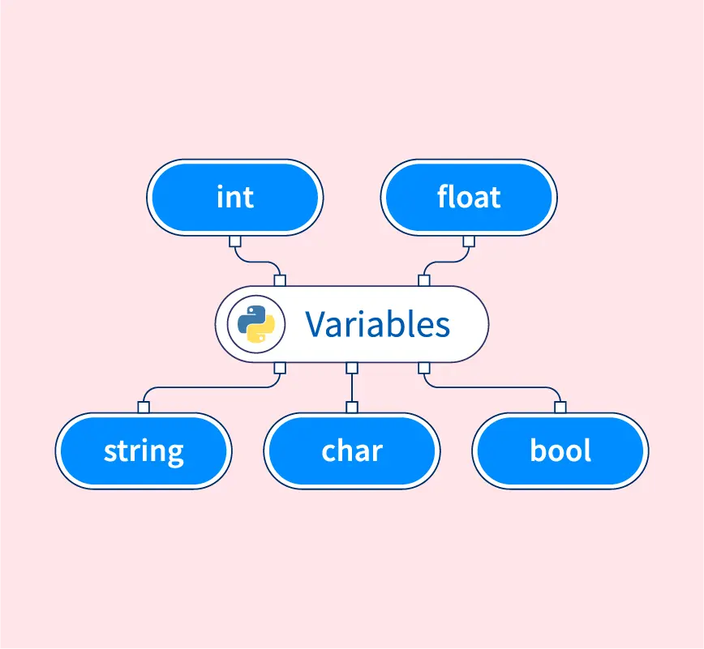

<!-- _class: title -->

# Variables | متغیرها
<br/>

**مدرس: [معین آعلی](https://github.com/moeeinaali)**

**تابستان ۱۴۰۴**

---

# متغیر چیه؟


**ظرف‌هایی از جنس‌های مختلف برای نگه‌داری اطلاعات درون خودشان!**
<br/>

### چه جنس‌هایی؟

- اعداد
  - صحیح
  - اعشاری
  - مختلط
- رشته‌ها
- منطقی

---
# انواع متغیرها



---

# چطور متغیر تعریف کنیم؟


+ تو پایتون نیازی نیست از کلیدواژه‌ خاصی استفاده کنی!
+ می‌تونیم مثل ریاضی متغیرهاتو نامگذاری و تعریف کنی!

مثلا:

```Python
x = 5
y = 3.14
name = "moeein"
flag = True
```

---

# چطور متغیر تعریف کنیم؟


### نمیشه چندتایی تعریف کرد؟

```python
x, y, z = "Orange", "Banana", "Cherry"
print(x)
print(y)
print(z)
```

###### معلومه که میشه!

### نمیشه چندتارو همزمان یک مقدار داد؟

```python
x = y = z = "Orange"
print(x)
print(y)
print(z)
```

###### معلومه که میشه!

---

# نامگذاری متغیرها


### چیا مجازه؟

- حروف کوچک و بزرگ
- آندرلاین (ـ)
- اعداد

### چطور مجازه؟

```Python
a1 = 2
first_name = "moeein"
first_name1 = "mamad"
_name = "moeein"
_1 = 2
```

### چطور مجاز نیست؟
عدد اول اسم بیاد!

---

# نامگذاری متغیرها

#### حواستون به بزرگ و کوچیک بودن کارکترها باشه!

```Python
a = 2
A = 3
aA = 4
Aa = 5
```

```python
naMe = "moeein"
namE = "saeed"
NamE = "amir"
nAmE = "amirhossein"
```

---

# نامگذاری متغیرها

### چطور نامگذاری کنیم؟


---

# چاپ کردن

### چطور مقدار یک متغیر رو چاپ کنیم؟

```Python
name = "moeein"
print("moeein")

age = 22
print(age)

flag = True
print(flag)
```

---
<!-- _class: title -->

# Printing | چاپ کردن
<br/>

**مدرس: [معین آعلی](https://github.com/moeeinaali)**

**تابستان ۱۴۰۴**

---


# چاپ کردن

### چطور مقدار یک متغیر رو چاپ کنیم؟

```Python
name = "moeein"
print("moeein")

age = 22
print(age)

flag = True
print(flag)
```

---

# چاپ کردن

### فقط چاپ کردن متغیر مجازه؟

```Python
print("moeein")

print(-2)

print(True)
```

###### معلومه که نه!

---

# چاپ کردن

### حتما باید یدونه‌ای چاپ کنیم؟

```Python
print("moeein", "amirhossein", "saeed")

print(1, 2, 3)

print(True, False, True, False)
```

###### معلومه که نه!

---

# چاپ کردن

### نمیشه هم متغیر چاپ کرد هم مقدار؟

```Python
name = "moeein"
print(name, "amirhossein", "saeed")

age = 18
print(1, 2, 3, age)

flag = True
print(flag, False)
```

###### معلومه که میشه!

---

# کلیدهای خاص

## n\ : زدن یک enter (رفتن به خط بعد)
## t\ : زدن یک tab


#### مثال:

```python
print("moeein\naali")

print("1\n2\n3")

print("1\n\n2")
```


---

# پایان خاص برای چاپ کردن

پایان معمولی:

```python
print("moeein" , end="\n")
```

یک پایان خاص:

```python
print("moeein" , end="***\n")
```

یک پایان خیلی خاص:

```python
print("moeein" , end="\t***\t")
print("saeed" , end="\t***\t")
```

---
<!-- _class: title -->

# Comments | کامنت‌ها
<br/>

**مدرس: [معین آعلی](https://github.com/moeeinaali)**

**تابستان ۱۴۰۴**

---


# کامنت چیه؟

**در پایتون، کامنت (Comment) متنی است که داخل کد نوشته می‌شود ولی توسط مفسر اجرا نمی‌شود.**

<br/>
<br/>

### هدف اصلی کامنت‌ها:

- توضیح کد برای خودت یا دیگران

- خواناتر کردن برنامه

- غیرفعال کردن موقت یک بخش از کد برای تست یا اشکال‌زدایی

---

# چطور کامنت بذاریم؟

## کامنت تک خطی:

```python
# This is a comment

print("Hello, World!")
```

##### حتی میشه کامنت رو جلو یک کد نوشت:

```python
print("Hello, World!") # This is a comment 
```
---

# چطور کامنت بذاریم؟

## کامنت چند خطی:

```python
# This is a comment
# written in
# more than one line

print("Hello, World!")
```

```python
"""
This is a comment
written in
more than one line
"""

print("Hello, World!")
```
---

<!-- _class: title -->

# Casting | تبدیل نوع داده


<br/>

**مدرس: [معین آعلی](https://github.com/moeeinaali)**

**تابستان ۱۴۰۴**

---
# یادآوری: انواع داده‌ها در پایتون

- اعداد صحیح (int)
- اعداد اعشاری (float)
- متغیر منطقی (bool)
- رشته (str)

```python
a = 2 # int

b = 2.2 # float

c = "2" # str

d = "moeein" # str

e = "#$%@#$^%GVEARFHGBEA4534Cfwefgw" # str
```

---

# تبدیل به int

#### تبدیل int به int:

```python
x = int(1)   # x will be 1
```

#### تبدیل float به int:
```python
y = int(2.9999) # y will be 2

y = int(2.0) # y will be 2
```

#### تبدیل str به int:
```python
z = int("3") # z will be 3

z = int("123m") # Error!
```

---

# تبدیل به float

#### تبدیل int به float:

```python
x = float(1)     # x will be 1.0
```

#### تبدیل float به float:
```python
y = float(2.8)   # y will be 2.8
```

#### تبدیل str به float:
```python
z = float("3")   # z will be 3.0

w = float("4.2") # w will be 4.2

p = float("4.2m") # Error!
```
---

# تبدیل به str


#### تبدیل float به str:

```python
a = str(1.2)
```

#### تبدیل int به str:

```python
b = str(1)
```

#### تبدیل str به str:

```python
b = str("1") 
```

---

# تبدیل به bool

#### تبدیل str به bool:

```python
print(bool("")) # False
print(bool("others")) # True
```

#### تبدیل int به bool:

```python
print(bool(0)) # False
print(bool(1)) # True
print(bool(-1)) # True
```

#### تبدیل float به bool:

```python
print(bool(0.0)) # False
print(bool(1.1)) # True
print(bool(-2.1)) # True
```

---

# تبدیل از bool

#### تبدیل bool به int:

```python
print(int(True)) # 1
print(int(False)) # 0
```

#### تبدیل bool به float:

```python
print(float(True)) # 1.0
print(float(False)) # 0.0
```

#### تبدیل bool به str:

```python
print(str(True)) # "True"
print(str(False)) # "False"
```

---

