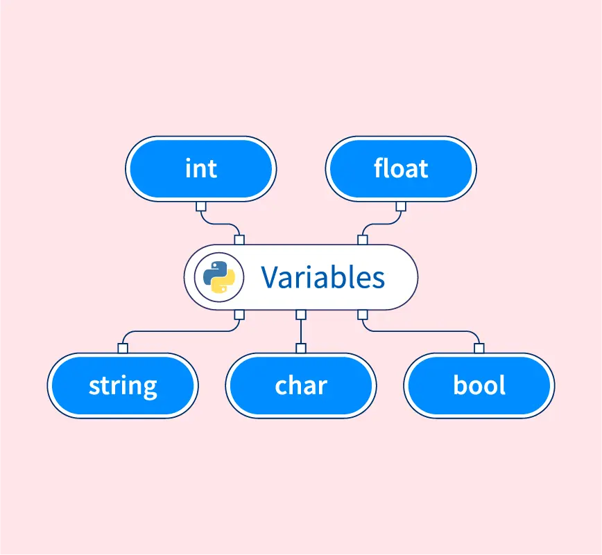

<!-- _class: title -->

# متغیرها در پایتون
<br/>

**مدرس: [معین آعلی](https://github.com/moeeinaali)**

**تابستان ۱۴۰۴**

---

# متغیر چیه؟


**ظرف‌هایی از جنس‌های مختلف برای نگه‌داری اطلاعات درون خودشان!**
<br/>

### چه جنس‌هایی؟

- اعداد
  - صحیح
  - اعشاری
  - مختلط
- رشته‌ها
- منطقی

---
# انواع متغیرها



---

# چطور متغیر تعریف کنیم؟


+ تو پایتون نیازی نیست از کلیدواژه‌ خاصی استفاده کنی!
+ می‌تونیم مثل ریاضی متغیرهاتو نامگذاری و تعریف کنی!

مثلا:

```Python
x = 5
y = 3.14
name = "moeein"
flag = True
```

---

# چطور متغیر تعریف کنیم؟


### نمیشه چندتایی تعریف کرد؟

```python
x, y, z = "Orange", "Banana", "Cherry"
print(x)
print(y)
print(z)
```

###### معلومه که میشه!

### نمیشه چندتارو همزمان یک مقدار داد؟

```python
x = y = z = "Orange"
print(x)
print(y)
print(z)
```

###### معلومه که میشه!

---

# نامگذاری متغیرها


### چیا مجازه؟

- حروف کوچک و بزرگ
- آندرلاین (ـ)
- اعداد

### چطور مجازه؟

```Python
a1 = 2
first_name = "moeein"
first_name1 = "mamad"
_name = "moeein"
_1 = 2
```

### چطور مجاز نیست؟
عدد اول اسم بیاد!

---

# نامگذاری متغیرها

#### حواستون به بزرگ و کوچیک بودن کارکترها باشه!

```Python
a = 2
A = 3
aA = 4
Aa = 5
```

```python
naMe = "moeein"
namE = "saeed"
NamE = "amir"
nAmE = "amirhossein"
```

---

# نامگذاری متغیرها

### چطور نامگذاری کنیم؟


---

# چاپ کردن

### چطور مقدار یک متغیر رو چاپ کنیم؟

```Python
name = "moeein"
print("moeein")

age = 22
print(age)

flag = True
print(flag)
```

